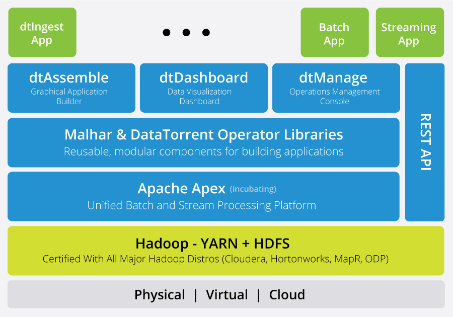

Getting to know DataTorrent RTS
===
DataTorrent RTS is an enterprise-grade unified stream and batch
processing platform. It is a high performing, fault tolerant, scalable,
Hadoop-native in-memory platform. DataTorrent RTS provides a complete
set of system services, thereby freeing developers from having to focus
on operability of the system. DataTorrent requires developers to be
familiar with only their business logic, never worrying about
platform-specific intricacies. The platform is capable of processing
billions of events per second and recovering from node outages with no
data loss and no human intervention.

Here are a few highlights of DataTorrent RTS 3:

**Simple, graphical application assembly**

Data scientists and developers can now create big data
applications without writing code. They simply assemble a data flow
using a drag-drop-launch GUI.

**Self-service real-time and historical visualization**

Business users and data scientists can accelerate time to insight
and take business action. Browser-based, RBAC-enabled intuitive,
self-service data visualization allows for the creation of custom
dashboards in minutes.

**Scalable, fault-tolerant data ingestion for Hadoop application**

Big data projects often stall due to difficulties ingesting data
whether at rest and in motion. The application provides a graphical
interface to ingest from multiple sources in a secure, high-performing,
fault tolerant manner.

**Enterprise integration and analytics pack**

Time-to-value is decreased using advanced pre-built connectors for
the most popular technologies and pre-built JAVA business logic for
analytical applications like dimensional analysis and transformations
like de-duplication.

**Production and operability enhancements**

Data center operations teams need to ensure that their business
crucial big data applications are operable across multiple data centers
and generations of applications.

DataTorrent RTS platform overview
---

Figure 1.1 &ndash; High-level view of DataTorrent Real Time Streaming Platform

**Apache Apex (incubating)**

Project Apex is industry's only open-source, enterprise-grade, unified stream
and batch processing engine that powers the core of DataTorrent RTS platform.

Project Apex includes these key features that are requested, but
not available until now, in the current open source technologies.

-   Event processing guarantees
-   In-memory performance & scalability
-   Fault tolerance and state management
-   Native rolling and tumbling window support
-   Hadoop-native YARN & HDFS implementation

**Malhar and DataTorrent Operator Libraries**

Big data applications ingest data from many sources, perform
complex processing on this data, and take action in real-time while
integrating with the existing enterprise applications and data sources.
DataTorrent RTS provides pre-built connectors for the most popular
technologies, such as message buses, SQL and NoSQL databases, flat
files, Kafka, Scoop, Flume, and Twitter. DataTorrent RTS also delivers
pre-built JAVA business logic for everything from MapReduce, to data
de-duplication, to real-time OLAP cubes, and to event driven rule
engines.

**dtAssemble**

dtAssemble, the Graphical Application Assembly tool, provides the ability to
easily and quickly create big data applications without coding. The DataTorrent
RTS graphical interface is drag-drop-launch in nature, which completely hides
the complexity of Hadoop. This enables users to quickly iterate on their data
analytics without requiring coding or enterprise developers.

**dtDashboard**

dtDashboard is the self-service real-time and historical data visualization
interface. Rapidly gaining insight and reducing time to action provides the
greatest value to an organization. DataTorrent RTS provides self-service
data visualization for the business user enabling them to not only see
dashboards and reports an order of magnitude faster, but to also create and
share customer reports.

**dtManage**

dtManage, the DataTorrent Management console, is a full Hadoop-integrated
application that provides an intuitive graphical interface for lights-out
management. DevOps teams can efficiently manage, monitor, update, and
troubleshoot the DataTorrent RTS system and applications.

**dtIngest**

dtIngest is the first pre-built end-to-end application that provides
data ingestion and extraction for Hadoop. Organizations struggle with
getting data into HDFS quickly and reliably, thereby reducing the
likelihood that a big data project will be brought to successful
conclusion. DataTorrent dtIngest for Hadoop is a standalone
application that can be integrated with DataTorrent RTS. The
application provides the ability to select from both batch and
streaming data sources, compress, compact and encrypt data, and store
into a single or multiple Hadoop cluster or other external
destination.

Note: For more information, see
[DataTorrent RTS](https://www.datatorrent.com/product/datatorrent-rts/)

DataTorrent terminology
---
**Operators**

Operators are basic computation units that are interconnected via
streams to form an application. You can think of operators as classes
implementing the _Operator_ interface. They read from incoming streams
of tuples and write to other streams. Operators also have properties and
attributes. Properties customize the functional definition of the
operator, while attributes customize the operational behavior.

**Streams**

A stream is a connector (edge) abstraction, which is a fundamental
building block of the DataTorrent RTS platform. A stream consists of
tuples that flow from one port to another.

**Ports**

Ports are connection points of an operator and are transient
objects declared in the Operator class. Tuples flow in and out through
ports. Input ports typically read from streams while output ports write to
streams.

**Web services**

DataTorrent RTS platform provides a robust webservices layer called
DT Gateway. Currently, Hadoop provides detailed web services for
map-reduce jobs. The DataTorrent RTS platform leverages the same
framework to provide a web service interface for real-time streaming
applications.

**Directed Acyclic Graph (DAG)**

A logical representation of a real-time stream processing
application. The computational units within a DAG are called operators
and the data-flow edges are called data streams.

**Streaming Application Manager (STRAM)**

Streaming Application Manager (STRAM) is the Hadoop YARN-native,
lightweight controller process. STRAM is the first process that is
activated upon application launch and orchestrates the streaming
application on the platform.

**Command-line Interface**

The _dtcli_ (DataTorrent Command Line Interface) tool is a wrapper
around the web services layer and allows the user to perform many
tasks from the command line such as starting and stopping
applications, retrieving detailed information about some or all
running applications, etc.
